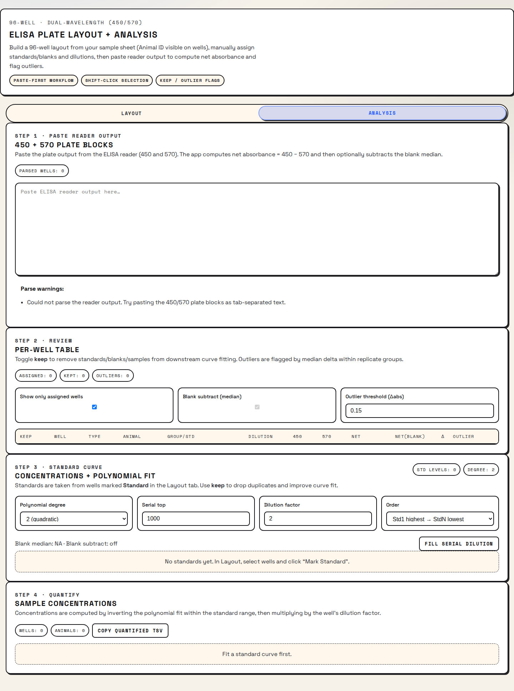

# ELISA Analysis App

Standalone app for ELISA 96-well plate layout + analysis (net absorbance, standard curves, quantification).



## What It Does

- Build a 96-well plate layout from a pasted sample table (TSV/CSV).
- Only **Animal ID** is rendered inside the wells (other columns are preserved as metadata).
- Select wells (including Shift-click range selection) and assign:
  - `Standard` levels (ex: `Std1`, `Std2`, ...)
  - `Blank`
  - sample metadata like dilution factor / group override
- Paste ELISA reader exports with **450 nm** and **570 nm** blocks.
- Compute **net absorbance**: `A450 - A570` (optional blank subtraction).
- Fit polynomial standard curves (degree 2/3), with:
  - per-replicate keep/remove
  - outlier flagging to help decide removals
- Quantify unknowns and export tables as TSV.

## Quick Start (Web)

Requirements: Node 20+.

```bash
npm ci
npm run dev
```

Then open `http://localhost:5180`.

### WSL Tip

If you run the dev server inside WSL, you can still open it in your Windows browser via:

```bash
explorer.exe http://localhost:5180
```

## Quality Checks

```bash
npm run lint
npm test
```

E2E smoke test (Playwright):

```bash
npm run test:e2e
```

## Desktop (Electron)

Dev (runs Vite dev server + Electron):

```bash
npm run desktop:dev
```

Build an installer (Electron Builder):

```bash
npm run desktop:dist
```

## Inputs

Layout input: paste a table where one column is `Animal ID` (and optionally `Group`). The app can auto-guess, but you can override mappings.

Reader input: paste the plate reader output that includes the 450 nm and 570 nm matrices (the app also supports a fallback list format).

## Roadmap

- Desktop installer (Electron)
- Merge into EasyLab Suite
